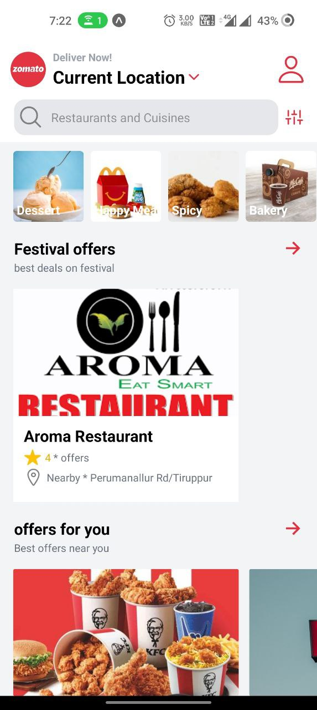
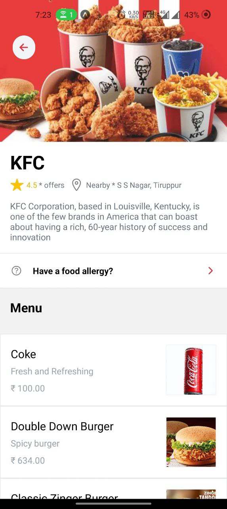
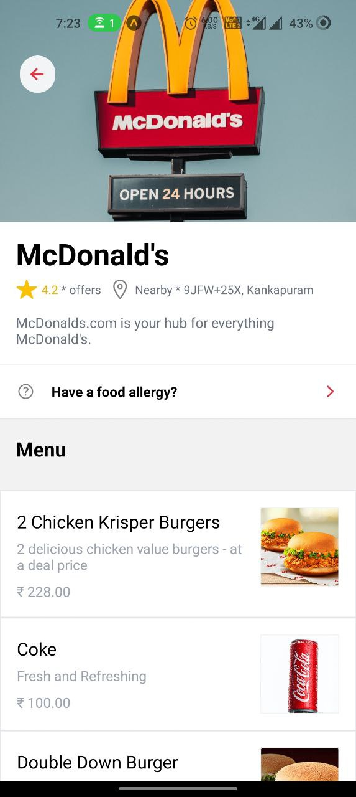
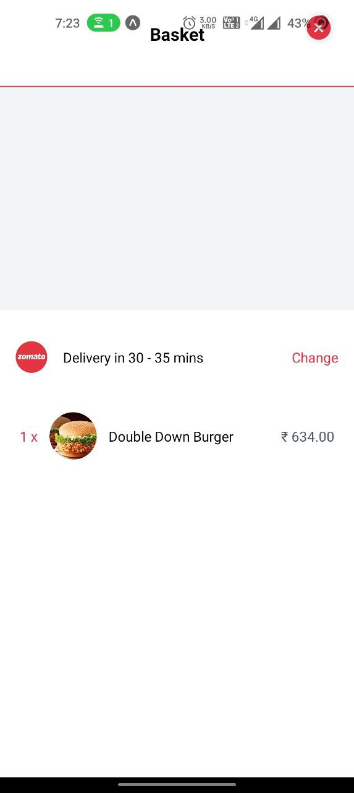

# zomato-clone

Stack - React-Native

zomato food delevery clone clone Mobile app using React-native and Sanity Backend

## Table of Contents
- [zomato-clone](#zomato-clone)
  - [Table of Contents](#table-of-contents)
  - [General info](#general-info)
  - [Libraries Used](#libraries-used)
  - [Technologies](#technologies)
  - [Setup](#setup)
  - [Examples](#examples)
    - [Home Page](#home-page)
    - [Restaurant Page:](#restaurant-page)
    - [Basket page :](#basket-page-)

## General info
Zomato Clone - Food Delivery Application Clone using React Native. In this Zomato App clone I have cloned maximum pages Home page, User Profile page, Food Selection page, Settings page etc...

As it is only frontend clone I have added static data but in a dynamic way so data can be changed easily or added easily.

## Libraries Used
|Library Name | Description|
| ----------- | ---------- | 
|React-Native | Frontend Framework|
|react-navigation | navigation library|
|nativewind | tailwindcss |
|react-redux | state management |
|Sanity | backend Framework |

## Technologies
|Tool Name | Description |
| ------- | -------------|
| Reactjs | Reactjs is a development environment tool|
|yarn | Package Manager tool|
| expo | Native runner |


## Setup
To run this project, install it locally using npm or yarn:

```
  $ yarn install
  
  $ yarn start
```

## Examples
### Home Page



<br>

### Restaurant Page:




<br>

### Basket page :
